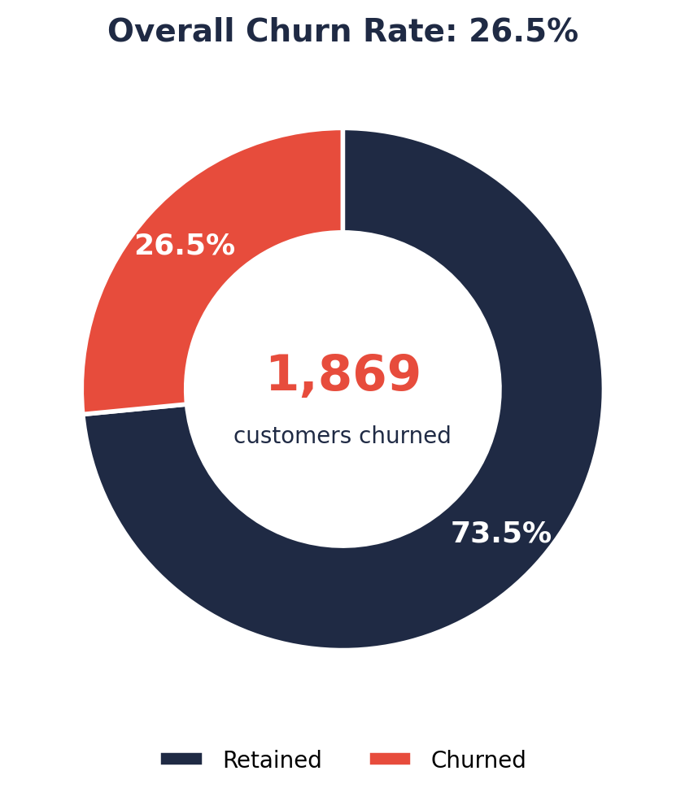
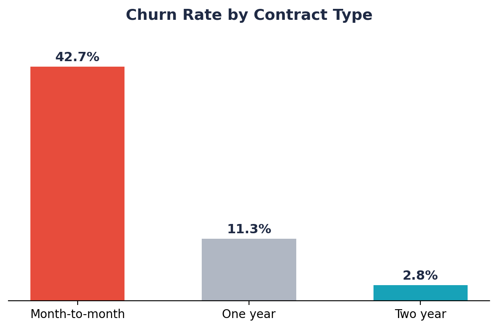
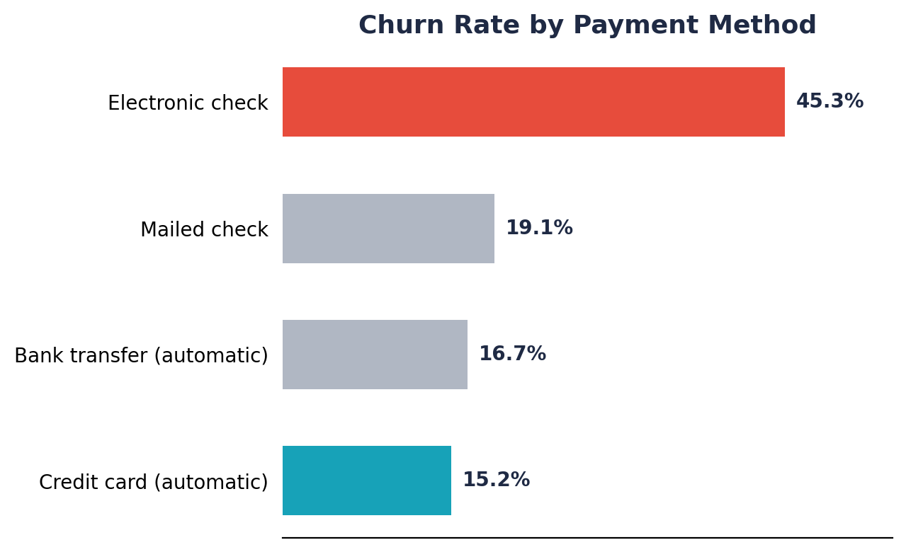
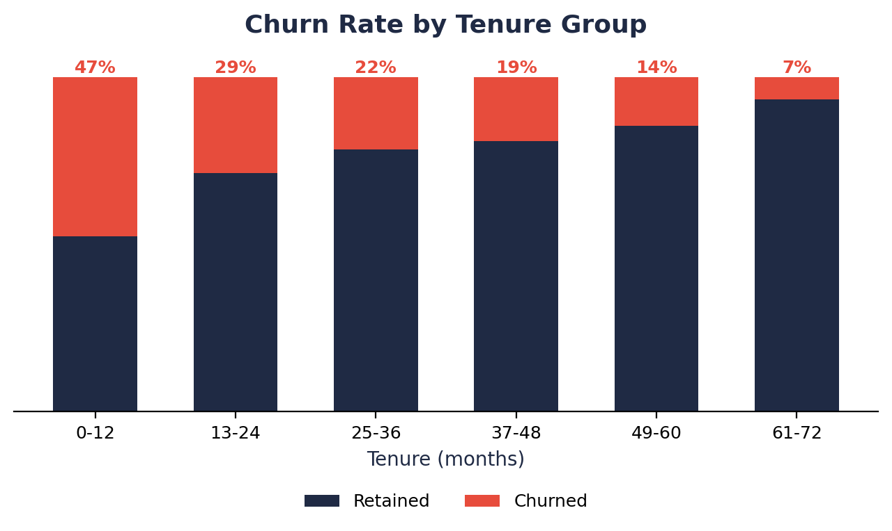
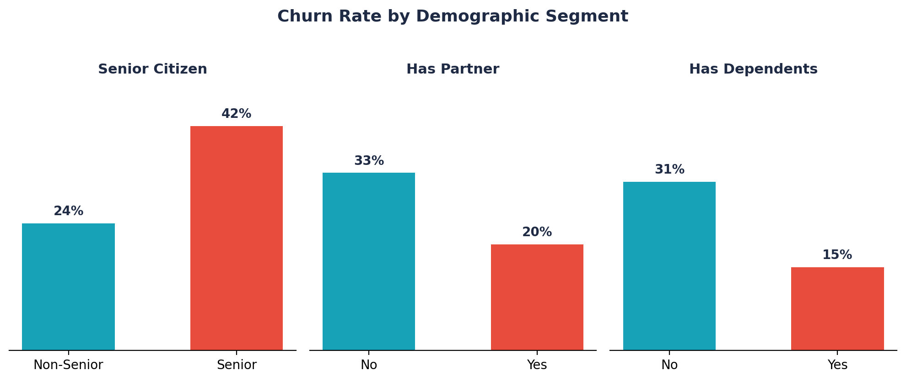

# 📉 Telco Customer Churn Analysis — Power BI Dashboard

An end-to-end churn analysis project built in Power BI, covering data cleaning, DAX measure design, and a 4-page interactive dashboard that identifies who is churning, why, and where retention efforts will have the biggest impact.



---

## 🧭 Table of Contents
- [Project Overview](#-project-overview)
- [Dataset](#-dataset)
- [Data Cleaning & Modeling](#-data-cleaning--modeling)
- [DAX Measures](#-dax-measures)
- [Dashboard Walkthrough](#-dashboard-walkthrough)
- [Key Insights](#-key-insights)
- [Recommendations](#-recommendations)
- [Tools Used](#-tools-used)
- [Repository Structure](#-repository-structure)
- [How to Use This Project](#-how-to-use-this-project)
- [How to Publish This to GitHub](#-how-to-publish-this-to-github)
- [Author](#-author)

---

## 📌 Project Overview

**Business problem:** A telecom provider wants to understand customer churn — the rate at which customers cancel their service — so it can prioritize retention efforts and protect revenue.

**Goal:** Use Power BI to explore the drivers of churn (contract type, tenure, payment method, services subscribed, demographics) and present the findings as a self-service dashboard that a retention/marketing team could act on.

**Headline result:** Of 7,043 customers, **1,869 churned**, an overall churn rate of **26.5%** — well above the telecom industry benchmark of roughly 15–20% annual churn.

---

## 🗂 Dataset

| | |
|---|---|
| **File** | `data/Telco_Customer_Churn_Dataset.csv` |
| **Rows** | 7,043 customers |
| **Columns** | 21 |
| **Source** | [IBM Telco Customer Churn sample dataset](https://www.kaggle.com/datasets/blastchar/telco-customer-churn) (public, originally published on Kaggle; this copy was sourced via a Saiket Systems internship dataset bundle) |
| **Grain** | One row per customer |
| **Target variable** | `Churn` (Yes/No) |

### Column dictionary

| Column | Description |
|---|---|
| `customerID` | Unique customer identifier |
| `gender` | Male / Female |
| `SeniorCitizen` | 1 if the customer is 65+, else 0 |
| `Partner` | Whether the customer has a partner |
| `Dependents` | Whether the customer has dependents |
| `tenure` | Number of months the customer has stayed with the company |
| `PhoneService` | Whether the customer has phone service |
| `MultipleLines` | Whether the customer has multiple phone lines |
| `InternetService` | DSL / Fiber optic / No |
| `OnlineSecurity` | Whether the customer has online security add-on |
| `OnlineBackup` | Whether the customer has online backup add-on |
| `DeviceProtection` | Whether the customer has device protection add-on |
| `TechSupport` | Whether the customer has tech support add-on |
| `StreamingTV` | Whether the customer has streaming TV |
| `StreamingMovies` | Whether the customer has streaming movies |
| `Contract` | Month-to-month / One year / Two year |
| `PaperlessBilling` | Whether the customer uses paperless billing |
| `PaymentMethod` | Electronic check / Mailed check / Bank transfer / Credit card |
| `MonthlyCharges` | Current monthly bill amount (USD) |
| `TotalCharges` | Total amount charged to the customer to date |
| `Churn` | Yes if the customer left within the last month, No otherwise |

### Known data quality issue
`TotalCharges` is stored as text and contains **11 blank values**, all belonging to customers with `tenure = 0` (i.e. brand-new customers who haven't been billed yet). This is handled in the data model — see below.

---

## 🧹 Data Cleaning & Modeling

Cleaning and shaping was done in Power Query (Power BI's data prep layer) before loading into the model:

- Converted `TotalCharges` from text to decimal; the 11 blank rows (tenure = 0, brand-new sign-ups) were imputed as `0` rather than dropped, so new customers still count toward total customer volume without skewing average revenue figures.
- Converted `SeniorCitizen` from a 0/1 flag into a readable `Senior Citizen` / `Non-Senior` label for visuals.
- Standardized "No internet service" / "No phone service" category labels across the add-on columns (`OnlineSecurity`, `TechSupport`, `StreamingTV`, etc.) for consistent grouping.
- Built calculated columns for binning, including a **Tenure Group** (0–12, 13–24, 25–48, 49–72 months) and an **Age Group** segment, to make trend charts easier to read than a raw 0–72 month axis.
- Created a `Churn Label` column as a friendlier display alias for the raw `Churn` field used inside measures.

---

## 🧮 DAX Measures

The model defines a set of explicit measures (rather than relying only on implicit aggregations), which keeps the report fast and the logic auditable. The key measures built for this report:

| Measure | Purpose |
|---|---|
| `Total Customers` | Total customer count in the filtered context |
| `Churned Customers` | Count of customers where `Churn = "Yes"` |
| `Retained Customers` | Count of customers where `Churn = "No"` |
| `Churn Rate` | `Churned Customers / Total Customers` |
| `C retention rate` | `Retained Customers / Total Customers` |
| `AVG Tenure(All)` | Average tenure across all customers |
| `Avg Tenure Churned` | Average tenure restricted to churned customers |
| `Avg Tenure Retained` | Average tenure restricted to retained customers |
| `Churn rate M2M` | Churn rate filtered to month-to-month contracts |
| `Churn rate fiber` | Churn rate filtered to Fiber optic internet customers |
| `Churn rate E-check` | Churn rate filtered to Electronic check payers |
| `Female customers` / `Male customers` | Gender split counts |
| `Customers w/Partner` | Count of customers with a partner, used for demographic cards |

These power-specific "drill" measures (`Churn rate M2M`, `Churn rate fiber`, `Churn rate E-check`) were added deliberately because the EDA showed these three segments are the biggest churn risk concentrations — see [Key Insights](#-key-insights) — so they get dedicated KPI cards on the dashboard rather than requiring a filter click.

---

## 📊 Dashboard Walkthrough

The `.pbix` contains **4 report pages** connected by navigation buttons in the top-right corner of each page.

### Page 1 — Executive Overview
KPI cards for Total Customers, Churned Customers, Retained Customers, and Churn Rate, plus a churn vs. retention donut and supporting commentary:
> *"Overall churn rate is 26.5% — above industry average of ~20%. 1,869 customers have already left the service. Reducing churn by 5% could retain ~350 more customers."*

### Page 2 — Demographics
Breaks churn down by gender, senior citizen status, partner status, and dependents, including a combined "Partner & Dependents Status" view to see how household structure relates to churn.

### Page 3 — Tenure & Risk
Highlights tenure as the strongest churn signal in the dataset, with a tenure-distribution-by-churn chart and a flagged "highest risk group: 0–12 months" callout — i.e., customers are most likely to leave in their first year.

### Page 4 — Services & Contract
Churn by contract type, payment method, and internet service type — the three categorical fields most associated with churn.

> 💡 **Add real screenshots here.** Static charts generated from the raw data are included below as a preview, but for the strongest portfolio presentation, open the `.pbix` in Power BI Desktop, switch to each page, and export screenshots (or use **File → Export → Export to PDF**, then convert pages to PNG) into `assets/screenshots/`. Then replace the chart images below with your real dashboard pages.

| | |
|---|---|
|  |  |
|  |  |

---

## 🔍 Key Insights

1. **Contract type is the single biggest churn driver.** Month-to-month customers churn at **42.7%**, versus **11.3%** for one-year contracts and just **2.8%** for two-year contracts. Customers without a long-term commitment leave far more often.
2. **New customers are the highest-risk group.** Churn is **47.4%** in the first 12 months of tenure, falling to **9.5%** for customers past 49 months. Churn risk drops steadily the longer a customer stays.
3. **Fiber optic internet customers churn more than twice as often as DSL customers** (41.9% vs. 19.0%), and customers with no internet service churn the least (7.4%) — possibly reflecting price sensitivity or service-quality issues specific to fiber.
4. **Electronic check payers are the highest-churn payment segment** at **45.3%**, nearly three times the rate of customers on automatic bank transfer (16.7%) or automatic credit card payment (15.2%). Manual payment methods correlate strongly with churn — likely a mix of payment friction and a more price-sensitive customer base.
5. **Household structure matters.** Customers with no partner churn at **33.0%** vs. **19.7%** for those with a partner; customers with no dependents churn at **31.3%** vs. **15.5%** for those with dependents. Customers without family ties to the account appear to switch providers more freely.
6. **Senior citizens churn nearly twice as often as non-seniors** (41.7% vs. 23.6%), suggesting either pricing or service-complexity issues for this segment.
7. **Paperless billing customers churn more** (33.6% vs. 16.3%) — this is likely a correlation rather than a cause, since paperless billing is more common among month-to-month, electronic-check customers, the same group already shown to be high-risk.

---

## ✅ Recommendations

- **Incentivize contract upgrades.** Offer month-to-month customers a discount or perk to move to a one- or two-year contract — this is the single highest-leverage lever in the data.
- **Build a "first 90 days" retention program.** Since churn is concentrated in the first 12 months, proactive onboarding check-ins, early-tenure discounts, or loyalty milestones could meaningfully reduce early drop-off.
- **Investigate fiber service experience.** The elevated fiber churn rate is worth a deeper look — is it price, installation experience, or reliability driving customers away?
- **Reduce friction on electronic check payments**, or migrate this segment toward autopay with an incentive, given how strongly payment method correlates with churn.
- **Target retention offers at senior, no-partner, and no-dependents segments**, who show the highest churn propensity among demographic groups.

---

## 🛠 Tools Used

- **Power BI Desktop** — data modeling, DAX, report design
- **Power Query (M)** — data cleaning and transformation
- **DAX** — calculated measures and columns
- Source dataset originally published as the IBM Telco Customer Churn sample on Kaggle

---

## 📁 Repository Structure

```
telco-customer-churn-analysis/
├── data/
│   └── Telco_Customer_Churn_Dataset.csv     # Raw source data (7,043 rows × 21 columns)
├── powerbi/
│   └── Customer_churn_analysis.pbix         # Finished Power BI report (4 pages)
├── assets/
│   ├── charts/                              # Illustrative charts generated from the raw data
│   └── screenshots/                         # ⬅ add real Power BI page screenshots here
├── README.md
└── .gitignore
```

---

## 🚀 How to Use This Project

1. **Explore the dashboard:** Open `powerbi/Customer_churn_analysis.pbix` in [Power BI Desktop](https://www.microsoft.com/en-us/power-platform/products/power-bi/desktop) (free, Windows only).
2. **Use your own data:** Replace `data/Telco_Customer_Churn_Dataset.csv` with another dataset that has the same column names, then click **Refresh** in Power BI — all visuals and measures will recalculate automatically.
3. **Re-run the illustrative charts:** The static PNG previews in `assets/charts/` were generated from the raw CSV using a small Python/pandas/matplotlib script. Re-running it after a data refresh will regenerate them to match.

---

## 🌐 How to Publish This to GitHub

Below is a complete walkthrough for getting this project onto GitHub as a portfolio piece, from a blank repo to a finished page.

### 1. Create the repository on GitHub
1. Go to [github.com/new](https://github.com/new).
2. Repository name: `telco-customer-churn-analysis` (or similar).
3. Set visibility to **Public** (so it's visible on your portfolio).
4. **Do not** initialize with a README — you already have one — and skip the `.gitignore`/license templates since this project includes its own.
5. Click **Create repository**, and keep the page open — GitHub will show you the remote URL you need in step 3.

### 2. Organize your local folder
Make sure your project folder on your computer matches the structure shown above:
```
telco-customer-churn-analysis/
├── data/Telco_Customer_Churn_Dataset.csv
├── powerbi/Customer_churn_analysis.pbix
├── assets/charts/...
├── assets/screenshots/...   (add your real dashboard screenshots here)
├── README.md
└── .gitignore
```

### 3. Push it with Git
Open a terminal in that folder and run:

```bash
git init
git add .
git commit -m "Initial commit: Telco customer churn Power BI analysis"
git branch -M main
git remote add origin https://github.com/<your-username>/telco-customer-churn-analysis.git
git push -u origin main
```

> Replace `<your-username>` with your actual GitHub username, and the URL with the one GitHub shows you after creating the repo (use the HTTPS or SSH version, whichever you have set up).

### 4. Don't have Git installed / never used the command line?
You can do all of this from the browser instead:
1. On your new (empty) repo page, click **uploading an existing file**.
2. Drag in the whole folder structure (or each file/folder one at a time — GitHub's web uploader supports dragging folders in most browsers).
3. Scroll down, add a commit message like `Initial commit`, and click **Commit changes**.

### 5. Polish the repo for your portfolio
- **Add real screenshots:** Open the `.pbix` in Power BI Desktop, go to each of the 4 pages, and use **File → Export → Export to PDF**, or simply take screenshots. Save them into `assets/screenshots/` as `page1-overview.png`, `page2-demographics.png`, `page3-tenure.png`, `page4-services.png`, then swap the image references in this README under [Dashboard Walkthrough](#-dashboard-walkthrough) to point at them instead of the illustrative charts.
- **Pin the repo:** On your GitHub profile, go to **Customize your pins** and pin this repository so it's one of the first things visitors see.
- **Add topics:** On the repo's main page, click the gear icon next to "About" and add topics like `power-bi`, `data-analysis`, `customer-churn`, `dax`, `dashboard` — this helps the project surface in GitHub search.
- **Set the "About" description and a link**, e.g. *"Power BI dashboard analyzing telecom customer churn drivers across 7,000+ customers."*
- **Large file note:** The `.pbix` file here is small (~0.6 MB), so a normal `git push` handles it fine. If you later attach a much larger `.pbix` (50MB+) to a different project, use [Git LFS](https://git-lfs.github.com/) instead of committing it directly.

### 6. Optional: add a live preview
GitHub can't render `.pbix` files inline, so visitors will need to download it to view it in Power BI Desktop. Two ways to make the project more accessible without that step:
- **Publish to Power BI Service** (if you have a Power BI account) and add the **public "Publish to web"** link to this README, so people can view the live dashboard in a browser.
- Keep the screenshots in `assets/screenshots/` thorough and high-resolution, so the README alone tells the full visual story even for visitors who never open Power BI.

---

## 👤 Author

*Add your name, LinkedIn, and a short blurb here, e.g.:*

**[Your Name]**
Data Analyst | Power BI · SQL · Python
[LinkedIn](#) · [Portfolio](#) · [Email](#)
